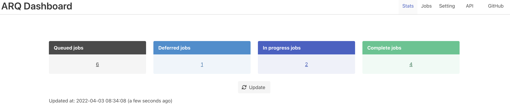
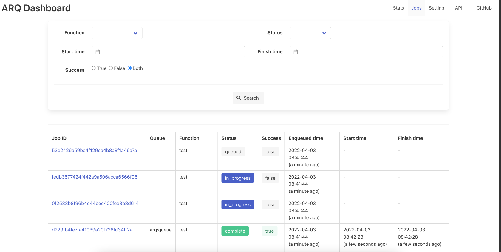

# arq-dashboard

[](https://badge.fury.io/py/arq-dashboard)
[](https://github.com/ninoseki/arq-dashboard/actions/workflows/test.yml)

A dashboard for [ARQ](https://github.com/samuelcolvin/arq) built with [FastAPI](https://github.com/tiangolo/fastapi).

## Screenshots



---



## Requirements

- Python 3.8+

## Installation

```bash
pip install arq-dashboard
```

## Docs

- [Configuration](https://github.com/ninoseki/arq-dashboard/wiki/Configuration)
- [Usage](https://github.com/ninoseki/arq-dashboard/wiki/Usage)
- [Advanced Usage](https://github.com/ninoseki/arq-dashboard/wiki/Advanced-Usage)

## Alternatives

- [SlavaSkvortsov/arq-django-admin](https://github.com/SlavaSkvortsov/arq-django-admin): Admin dashboard for arq based on django-rq
- [long2ice/rearq](https://github.com/long2ice/rearq): A distributed task queue built with asyncio and redis, with built-in web interface
- [tobymao/saq](https://github.com/tobymao/saq): Simple Async Queues
